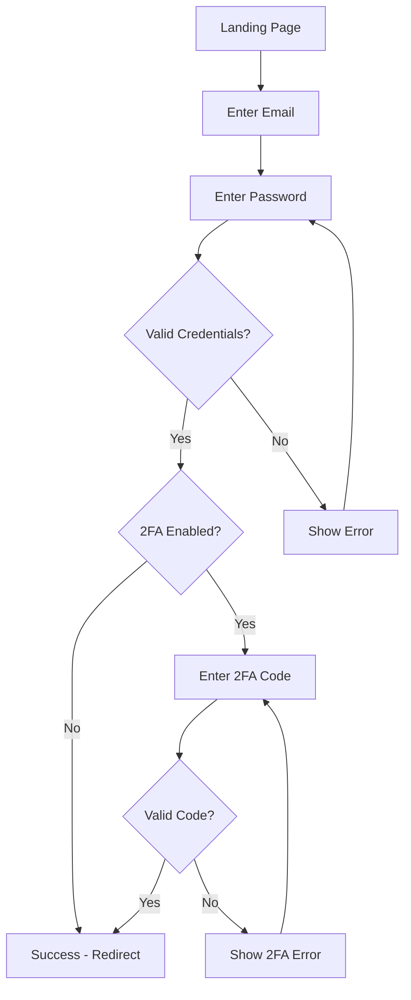

# Modern Admin Login Page Design Guide 2024/2025

## Executive Summary

This comprehensive guide outlines the latest design patterns, UX best practices, and technical requirements for creating modern admin login pages in 2024/2025. Based on extensive research of current trends, accessibility standards, and enterprise security requirements.

## Table of Contents

1. [Visual Design Patterns](#visual-design-patterns)
2. [UX Best Practices](#ux-best-practices)
3. [Accessibility Considerations](#accessibility-considerations)
4. [Mobile Responsive Patterns](#mobile-responsive-patterns)
5. [Dark/Light Mode Design](#dark-light-mode-design)
6. [Security Features](#security-features)
7. [Loading and Error States](#loading-and-error-states)
8. [Authentication Flows](#authentication-flows)
9. [Implementation Guidelines](#implementation-guidelines)
10. [Testing Checklist](#testing-checklist)

---

## Visual Design Patterns

### Layout Composition Trends

#### **Split-Screen Layout**
- **50/50 Division**: Left side for branding/imagery, right side for login form
- **Brand Showcase**: Utilize left panel for product screenshots, testimonials, or brand messaging
- **Visual Balance**: Maintain visual weight between brand content and functional elements

#### **Centered Card Layout**
- **Floating Cards**: Elevated login cards with subtle shadows and rounded corners (8-16px radius)
- **Minimal Footprint**: Compact form design that doesn't overwhelm the screen
- **Background Treatments**: Subtle gradients, geometric patterns, or brand imagery

#### **Full-Screen Immersive**
- **Background Integration**: Login forms overlaid on brand-relevant imagery
- **Progressive Disclosure**: Multi-step authentication flows with smooth transitions
- **Visual Hierarchy**: Clear distinction between background and interactive elements

### Color Schemes 2024/2025

#### **Primary Palette**
```css
/* Modern Neutral Base */
--primary-50: #f8fafc;
--primary-100: #f1f5f9;
--primary-500: #64748b;
--primary-900: #0f172a;

/* Brand Accent Colors */
--accent-blue: #3b82f6;
--accent-purple: #8b5cf6;
--accent-green: #10b981;

/* Status Colors */
--success: #059669;
--warning: #d97706;
--error: #dc2626;
--info: #0284c7;
```

#### **Gradient Trends**
- **Subtle Brand Gradients**: 15-30% opacity overlays
- **Mesh Gradients**: Multi-color flowing backgrounds
- **Glassmorphism**: Frosted glass effects with backdrop blur

### Typography Choices

#### **Font Stack Recommendations**
```css
/* Primary Headings */
font-family: 'Inter', 'Segoe UI', system-ui, sans-serif;

/* Body Text */
font-family: 'Inter', -apple-system, BlinkMacSystemFont, sans-serif;

/* Monospace (codes/tokens) */
font-family: 'JetBrains Mono', 'SF Mono', Consolas, monospace;
```

#### **Type Scale**
```css
/* Display */
--text-4xl: 2.25rem; /* 36px - Page titles */
--text-3xl: 1.875rem; /* 30px - Section headers */
--text-2xl: 1.5rem; /* 24px - Card titles */
--text-xl: 1.25rem; /* 20px - Subheadings */
--text-lg: 1.125rem; /* 18px - Large body */
--text-base: 1rem; /* 16px - Default body */
--text-sm: 0.875rem; /* 14px - Small text */
--text-xs: 0.75rem; /* 12px - Captions */
```

#### **Weight Distribution**
- **Headings**: 600-700 (semibold to bold)
- **Body Text**: 400-500 (normal to medium)
- **Labels**: 500-600 (medium to semibold)
- **Captions**: 400 (normal)

---

## UX Best Practices

### Form Design Principles

#### **Progressive Enhancement**
1. **Core Functionality First**: Ensure login works without JavaScript
2. **Enhanced Experience**: Add smooth animations and micro-interactions
3. **Graceful Degradation**: Maintain usability across all devices and browsers

#### **Input Field Optimization**
```typescript
interface LoginFormFields {
  email: {
    type: 'email';
    autocomplete: 'username';
    required: true;
    validation: 'real-time';
  };
  password: {
    type: 'password';
    autocomplete: 'current-password';
    required: true;
    showToggle: true;
  };
  remember: {
    type: 'checkbox';
    defaultChecked: false;
    position: 'below-password';
  };
}
```

#### **Form Validation Strategy**
- **Real-time Validation**: Immediate feedback for email format, password requirements
- **Progressive Disclosure**: Show password requirements on focus, not before
- **Clear Error Messages**: Specific, actionable error descriptions
- **Success Indicators**: Subtle checkmarks for valid inputs

### Conversion Optimization

#### **Friction Reduction**
- **Single-Step Login**: Avoid multi-step flows for standard authentication
- **Smart Defaults**: Remember email addresses, provide reasonable session lengths
- **Social Login Options**: Google, Microsoft, Apple for enterprise environments
- **Biometric Integration**: Fingerprint, Face ID where supported

#### **Trust Signals**
- **Security Badges**: SSL certificates, compliance logos (SOC 2, GDPR)
- **Company Information**: Clear branding, contact information
- **Privacy Links**: Easily accessible privacy policy and terms
- **Password Security**: Visible security requirements and breach monitoring

### Error Prevention

#### **Input Assistance**
- **Format Hints**: Email format examples, password requirements
- **Autocomplete Support**: Proper autocomplete attributes for password managers
- **Typo Detection**: Suggest corrections for common email domain typos
- **Caps Lock Detection**: Alert users when caps lock is enabled

---

## Accessibility Considerations

### WCAG 2.1 Level AA Compliance

#### **Color and Contrast**
```css
/* Minimum Contrast Ratios */
--contrast-normal: 4.5:1; /* Normal text */
--contrast-large: 3:1; /* Large text (18pt+ or 14pt+ bold) */
--contrast-ui: 3:1; /* UI components and graphics */

/* Color-blind Friendly Palette */
--accessible-blue: #0066cc;
--accessible-green: #00cc66;
--accessible-red: #cc3300;
--accessible-orange: #ff9900;
```

#### **Focus Management**
```css
/* Custom Focus Styles */
.focus-visible {
  outline: 2px solid var(--accent-blue);
  outline-offset: 2px;
  border-radius: 4px;
}

/* Skip Links */
.skip-link {
  position: absolute;
  top: -40px;
  left: 6px;
  background: var(--primary-900);
  color: white;
  padding: 8px;
  text-decoration: none;
  border-radius: 4px;
}

.skip-link:focus {
  top: 6px;
}
```

#### **Screen Reader Support**
```html
<!-- Proper Form Labels -->
<label for="email" class="sr-only">Email Address</label>
<input
  id="email"
  type="email"
  aria-describedby="email-error email-hint"
  aria-invalid="false"
  autocomplete="username"
/>

<!-- Error Announcements -->
<div id="email-error" role="alert" aria-live="polite">
  Please enter a valid email address
</div>

<!-- Loading States -->
<button type="submit" aria-describedby="login-status">
  <span aria-hidden="true">Sign In</span>
  <span id="login-status" class="sr-only">
    Signing you in...
  </span>
</button>
```

### Keyboard Navigation

#### **Tab Order Optimization**
1. Logo/Brand (if linked)
2. Email input field
3. Password input field
4. Show/hide password toggle
5. Remember me checkbox
6. Sign in button
7. Forgot password link
8. Create account link
9. Social login buttons

#### **Keyboard Shortcuts**
```javascript
// Enter key submission
document.addEventListener('keydown', (e) => {
  if (e.key === 'Enter' && e.target.matches('input[type="email"], input[type="password"]')) {
    e.preventDefault();
    document.querySelector('button[type="submit"]').click();
  }
});

// Escape key to clear errors
document.addEventListener('keydown', (e) => {
  if (e.key === 'Escape') {
    clearFormErrors();
  }
});
```

---

## Mobile Responsive Patterns

### Viewport Configuration

#### **Meta Tags**
```html
<meta name="viewport" content="width=device-width, initial-scale=1.0, maximum-scale=5.0">
<meta name="format-detection" content="telephone=no">
<meta name="mobile-web-app-capable" content="yes">
```

#### **Responsive Breakpoints**
```css
/* Mobile First Approach */
/* xs: 0px - 475px (default) */
/* sm: 476px - 639px */
@media (min-width: 640px) { /* sm */ }

/* md: 640px - 767px */
@media (min-width: 768px) { /* md */ }

/* lg: 768px - 1023px */
@media (min-width: 1024px) { /* lg */ }

/* xl: 1024px+ */
@media (min-width: 1280px) { /* xl */ }
```

### Touch-Optimized Design

#### **Touch Target Sizing**
```css
/* Minimum Touch Targets (WCAG 2.1) */
.touch-target {
  min-height: 44px; /* iOS recommendation */
  min-width: 44px;
  padding: 12px 16px;
  margin: 8px 0;
}

/* Input Fields */
input, button, select {
  min-height: 44px;
  font-size: 16px; /* Prevents zoom on iOS */
  border-radius: 8px;
}
```

#### **Gesture Support**
```javascript
// Swipe gestures for multi-step flows
const gesture = new Hammer(loginContainer);
gesture.get('swipe').set({ direction: Hammer.DIRECTION_HORIZONTAL });

gesture.on('swipeleft', () => {
  // Navigate to next step
  showNextAuthStep();
});

gesture.on('swiperight', () => {
  // Navigate to previous step
  showPreviousAuthStep();
});
```

### Layout Adaptations

#### **Stacked Layout (Mobile)**
```css
@media (max-width: 767px) {
  .login-container {
    display: block;
    padding: 16px;
  }

  .login-form {
    width: 100%;
    max-width: 400px;
    margin: 0 auto;
  }

  .brand-section {
    display: none; /* Hide on small screens */
  }
}
```

#### **Split Layout (Desktop)**
```css
@media (min-width: 768px) {
  .login-container {
    display: grid;
    grid-template-columns: 1fr 1fr;
    min-height: 100vh;
  }

  .brand-section {
    display: flex;
    align-items: center;
    justify-content: center;
  }
}
```

---

## Dark/Light Mode Design

### Color System Architecture

#### **CSS Custom Properties**
```css
:root {
  /* Light Mode (Default) */
  --bg-primary: #ffffff;
  --bg-secondary: #f8fafc;
  --text-primary: #1e293b;
  --text-secondary: #64748b;
  --border-color: #e2e8f0;
  --accent: #3b82f6;
}

[data-theme="dark"] {
  /* Dark Mode */
  --bg-primary: #0f172a;
  --bg-secondary: #1e293b;
  --text-primary: #f1f5f9;
  --text-secondary: #94a3b8;
  --border-color: #334155;
  --accent: #60a5fa;
}

/* Auto-detect system preference */
@media (prefers-color-scheme: dark) {
  :root {
    --bg-primary: #0f172a;
    --bg-secondary: #1e293b;
    --text-primary: #f1f5f9;
    --text-secondary: #94a3b8;
    --border-color: #334155;
    --accent: #60a5fa;
  }
}
```

#### **Theme Toggle Implementation**
```typescript
interface ThemeState {
  current: 'light' | 'dark' | 'system';
  preference: 'light' | 'dark' | 'system';
}

const useTheme = () => {
  const [theme, setTheme] = useState<ThemeState>({
    current: 'system',
    preference: 'system'
  });

  const toggleTheme = () => {
    const newTheme = theme.current === 'light' ? 'dark' : 'light';
    setTheme(prev => ({ ...prev, current: newTheme, preference: newTheme }));
    document.documentElement.setAttribute('data-theme', newTheme);
    localStorage.setItem('theme', newTheme);
  };

  return { theme, toggleTheme };
};
```

### Dark Mode Best Practices

#### **Contrast and Readability**
```css
/* Ensure sufficient contrast in dark mode */
.dark-mode {
  /* Text on dark backgrounds */
  --text-contrast: #f8fafc; /* 15.8:1 ratio */
  --text-muted: #cbd5e1; /* 9.2:1 ratio */

  /* Interactive elements */
  --button-primary: #3b82f6;
  --button-primary-hover: #2563eb;
  --button-text: #ffffff;

  /* Form elements */
  --input-bg: #1e293b;
  --input-border: #475569;
  --input-border-focus: #60a5fa;
}
```

#### **Visual Hierarchy in Dark Mode**
- **Elevated Surfaces**: Use lighter shades for cards and modals
- **Reduced Shadows**: Minimize drop shadows, use borders instead
- **Color Temperature**: Slightly warm the color palette to reduce eye strain
- **Brand Colors**: Adjust brand colors for better dark mode contrast

---

## Security Features

### Two-Factor Authentication (2FA)

#### **2FA Flow Design**
```typescript
interface TwoFactorAuthFlow {
  step1: {
    title: "Enter Verification Code";
    description: "Check your authenticator app for a 6-digit code";
    input: {
      type: "numeric";
      length: 6;
      autoComplete: "one-time-code";
      pattern: "[0-9]{6}";
    };
  };
  step2: {
    title: "Backup Codes";
    description: "Use one of your backup codes if you can't access your authenticator";
    link: "Use backup code instead";
  };
}
```

#### **2FA Input Component**
```tsx
const TwoFactorInput = () => {
  const [code, setCode] = useState(['', '', '', '', '', '']);

  const handleInputChange = (value: string, index: number) => {
    const newCode = [...code];
    newCode[index] = value;
    setCode(newCode);

    // Auto-focus next input
    if (value && index < 5) {
      const nextInput = document.getElementById(`code-${index + 1}`);
      nextInput?.focus();
    }
  };

  return (
    <div className="flex gap-2 justify-center">
      {code.map((digit, index) => (
        <input
          key={index}
          id={`code-${index}`}
          type="text"
          maxLength={1}
          value={digit}
          onChange={(e) => handleInputChange(e.target.value, index)}
          className="w-12 h-12 text-center border rounded-lg text-lg font-mono"
          autoComplete="one-time-code"
        />
      ))}
    </div>
  );
};
```

### Single Sign-On (SSO)

#### **SSO Button Design**
```tsx
const SSOButton = ({ provider, onClick }: { provider: string, onClick: () => void }) => {
  const providers = {
    google: {
      icon: <GoogleIcon />,
      text: "Continue with Google",
      bgColor: "bg-white",
      textColor: "text-gray-700",
      borderColor: "border-gray-300"
    },
    microsoft: {
      icon: <MicrosoftIcon />,
      text: "Continue with Microsoft",
      bgColor: "bg-blue-600",
      textColor: "text-white",
      borderColor: "border-blue-600"
    },
    saml: {
      icon: <BuildingIcon />,
      text: "Continue with SSO",
      bgColor: "bg-gray-100",
      textColor: "text-gray-700",
      borderColor: "border-gray-300"
    }
  };

  const config = providers[provider];

  return (
    <button
      onClick={onClick}
      className={`w-full flex items-center justify-center gap-3 px-4 py-3 rounded-lg border transition-all hover:opacity-90 ${config.bgColor} ${config.textColor} ${config.borderColor}`}
    >
      {config.icon}
      <span className="font-medium">{config.text}</span>
    </button>
  );
};
```

### Password Security Features

#### **Password Strength Indicator**
```tsx
const PasswordStrengthIndicator = ({ password }: { password: string }) => {
  const calculateStrength = (pwd: string) => {
    let score = 0;
    if (pwd.length >= 8) score++;
    if (/[a-z]/.test(pwd)) score++;
    if (/[A-Z]/.test(pwd)) score++;
    if (/[0-9]/.test(pwd)) score++;
    if (/[^A-Za-z0-9]/.test(pwd)) score++;
    return score;
  };

  const strength = calculateStrength(password);
  const strengthLabels = ['Very Weak', 'Weak', 'Fair', 'Good', 'Strong'];
  const strengthColors = ['bg-red-500', 'bg-orange-500', 'bg-yellow-500', 'bg-blue-500', 'bg-green-500'];

  return (
    <div className="mt-2">
      <div className="flex gap-1 mb-1">
        {[1, 2, 3, 4, 5].map((level) => (
          <div
            key={level}
            className={`h-1 flex-1 rounded ${
              level <= strength ? strengthColors[strength - 1] : 'bg-gray-200'
            }`}
          />
        ))}
      </div>
      <p className="text-sm text-gray-600">
        Password strength: {strengthLabels[strength - 1] || 'Enter a password'}
      </p>
    </div>
  );
};
```

#### **Security Recommendations Display**
```tsx
const SecurityRecommendations = () => {
  return (
    <div className="bg-blue-50 border border-blue-200 rounded-lg p-4 mt-4">
      <h3 className="font-semibold text-blue-900 mb-2">Security Tips</h3>
      <ul className="text-sm text-blue-800 space-y-1">
        <li>• Use a unique password you don't use elsewhere</li>
        <li>• Enable two-factor authentication for extra security</li>
        <li>• Consider using a password manager</li>
        <li>• Your password is encrypted and secure</li>
      </ul>
    </div>
  );
};
```

---

## Loading and Error States

### Loading State Patterns

#### **Button Loading States**
```tsx
const LoadingButton = ({ isLoading, children, ...props }: ButtonProps) => {
  return (
    <button
      {...props}
      disabled={isLoading || props.disabled}
      className={`relative ${props.className}`}
    >
      {isLoading && (
        <div className="absolute inset-0 flex items-center justify-center">
          <div className="w-5 h-5 border-2 border-white border-t-transparent rounded-full animate-spin" />
        </div>
      )}
      <span className={isLoading ? 'opacity-0' : 'opacity-100'}>
        {children}
      </span>
    </button>
  );
};
```

#### **Form Loading Overlay**
```tsx
const FormLoadingOverlay = ({ isLoading }: { isLoading: boolean }) => {
  if (!isLoading) return null;

  return (
    <div className="absolute inset-0 bg-white/80 backdrop-blur-sm flex items-center justify-center z-10">
      <div className="text-center">
        <div className="w-8 h-8 border-2 border-blue-600 border-t-transparent rounded-full animate-spin mx-auto mb-2" />
        <p className="text-sm text-gray-600">Signing you in...</p>
      </div>
    </div>
  );
};
```

### Error State Handling

#### **Error Message Component**
```tsx
interface ErrorMessageProps {
  type: 'field' | 'form' | 'system';
  message: string;
  action?: {
    label: string;
    onClick: () => void;
  };
}

const ErrorMessage = ({ type, message, action }: ErrorMessageProps) => {
  const iconMap = {
    field: <AlertCircleIcon className="w-4 h-4" />,
    form: <XCircleIcon className="w-5 h-5" />,
    system: <ExclamationTriangleIcon className="w-5 h-5" />
  };

  const styleMap = {
    field: "text-red-600 text-sm",
    form: "bg-red-50 border border-red-200 text-red-800 p-4 rounded-lg",
    system: "bg-yellow-50 border border-yellow-200 text-yellow-800 p-4 rounded-lg"
  };

  return (
    <div className={`flex items-start gap-2 ${styleMap[type]}`} role="alert">
      {iconMap[type]}
      <div className="flex-1">
        <p>{message}</p>
        {action && (
          <button
            onClick={action.onClick}
            className="mt-2 text-sm underline hover:no-underline"
          >
            {action.label}
          </button>
        )}
      </div>
    </div>
  );
};
```

#### **Common Error Scenarios**
```typescript
const errorMessages = {
  invalidCredentials: {
    title: "Invalid email or password",
    message: "Please check your credentials and try again.",
    action: { label: "Forgot password?", href: "/forgot-password" }
  },
  accountLocked: {
    title: "Account temporarily locked",
    message: "Too many failed attempts. Try again in 15 minutes.",
    action: { label: "Contact support", href: "/support" }
  },
  networkError: {
    title: "Connection problem",
    message: "Please check your internet connection and try again.",
    action: { label: "Retry", onClick: () => window.location.reload() }
  },
  maintenanceMode: {
    title: "System maintenance",
    message: "We're performing updates. Please try again in a few minutes.",
    action: { label: "Status page", href: "/status" }
  }
};
```

### Success State Feedback

#### **Success Animation**
```tsx
const SuccessAnimation = () => {
  return (
    <div className="flex items-center justify-center">
      <div className="relative">
        <div className="w-16 h-16 bg-green-100 rounded-full flex items-center justify-center">
          <CheckIcon className="w-8 h-8 text-green-600 animate-scale-in" />
        </div>
        <div className="absolute inset-0 bg-green-200 rounded-full animate-ping opacity-75" />
      </div>
    </div>
  );
};
```

---

## Authentication Flows

### Standard Email/Password Flow

#### **Flow Diagram**


#### **Implementation Steps**
```typescript
interface AuthFlow {
  step1_email: {
    validate: (email: string) => boolean;
    next: 'step2_password';
  };
  step2_password: {
    validate: (password: string) => Promise<boolean>;
    next: 'step3_2fa' | 'success';
  };
  step3_2fa?: {
    validate: (code: string) => Promise<boolean>;
    next: 'success';
  };
  success: {
    redirect: string;
  };
}
```

### Forgot Password Flow

#### **Reset Password Process**
```tsx
const ForgotPasswordFlow = () => {
  const [step, setStep] = useState<'email' | 'sent' | 'reset'>('email');
  const [email, setEmail] = useState('');

  const handleEmailSubmit = async (email: string) => {
    try {
      await sendPasswordResetEmail(email);
      setStep('sent');
    } catch (error) {
      // Handle error
    }
  };

  return (
    <div className="max-w-md mx-auto">
      {step === 'email' && (
        <EmailStep onSubmit={handleEmailSubmit} />
      )}
      {step === 'sent' && (
        <SentStep email={email} onResend={() => handleEmailSubmit(email)} />
      )}
      {step === 'reset' && (
        <ResetStep />
      )}
    </div>
  );
};
```

### Remember Me Implementation

#### **Secure Remember Me**
```typescript
interface RememberMeConfig {
  tokenDuration: '7d' | '30d' | '90d';
  securityLevel: 'basic' | 'enhanced';
  deviceFingerprinting: boolean;
}

const handleRememberMe = async (remember: boolean, config: RememberMeConfig) => {
  if (remember) {
    // Generate secure token
    const rememberToken = await generateSecureToken();

    // Set secure cookie
    document.cookie = `remember_token=${rememberToken}; ` +
      `max-age=${getDurationInSeconds(config.tokenDuration)}; ` +
      `secure; samesite=strict; httponly`;

    // Store device fingerprint if enabled
    if (config.deviceFingerprinting) {
      const fingerprint = await generateDeviceFingerprint();
      localStorage.setItem('device_id', fingerprint);
    }
  }
};
```

---

## Implementation Guidelines

### React Component Architecture

#### **Base Login Component**
```tsx
interface LoginPageProps {
  variant?: 'default' | 'modal' | 'embedded';
  theme?: 'light' | 'dark' | 'auto';
  features?: {
    sso?: boolean;
    twoFactor?: boolean;
    rememberMe?: boolean;
    socialLogin?: string[];
  };
  onSuccess?: (user: User) => void;
  onError?: (error: Error) => void;
}

const LoginPage: React.FC<LoginPageProps> = ({
  variant = 'default',
  theme = 'auto',
  features = {},
  onSuccess,
  onError
}) => {
  // Component implementation
};
```

#### **Form Validation Hook**
```typescript
const useLoginValidation = () => {
  const [errors, setErrors] = useState<Record<string, string>>({});

  const validateEmail = (email: string): boolean => {
    const emailRegex = /^[^\s@]+@[^\s@]+\.[^\s@]+$/;
    const isValid = emailRegex.test(email);

    setErrors(prev => ({
      ...prev,
      email: isValid ? '' : 'Please enter a valid email address'
    }));

    return isValid;
  };

  const validatePassword = (password: string): boolean => {
    const isValid = password.length >= 8;

    setErrors(prev => ({
      ...prev,
      password: isValid ? '' : 'Password must be at least 8 characters'
    }));

    return isValid;
  };

  return { errors, validateEmail, validatePassword };
};
```

### CSS Framework Integration

#### **Tailwind CSS Classes**
```css
/* Login Container */
.login-container {
  @apply min-h-screen bg-gradient-to-br from-blue-50 to-purple-50 flex items-center justify-center p-4;
}

/* Login Card */
.login-card {
  @apply bg-white rounded-2xl shadow-xl p-8 w-full max-w-md border border-gray-100;
}

/* Form Inputs */
.form-input {
  @apply w-full px-4 py-3 border border-gray-300 rounded-lg focus:ring-2 focus:ring-blue-500 focus:border-transparent transition-all;
}

/* Primary Button */
.btn-primary {
  @apply w-full bg-blue-600 text-white py-3 px-4 rounded-lg font-medium hover:bg-blue-700 focus:ring-2 focus:ring-blue-500 focus:ring-offset-2 transition-all;
}

/* Dark Mode Variants */
.dark .login-container {
  @apply from-gray-900 to-blue-900;
}

.dark .login-card {
  @apply bg-gray-800 border-gray-700;
}

.dark .form-input {
  @apply bg-gray-700 border-gray-600 text-white placeholder-gray-400;
}
```

#### **CSS Custom Properties Setup**
```css
:root {
  /* Spacing */
  --space-xs: 0.25rem;
  --space-sm: 0.5rem;
  --space-md: 1rem;
  --space-lg: 1.5rem;
  --space-xl: 2rem;

  /* Border Radius */
  --radius-sm: 0.375rem;
  --radius-md: 0.5rem;
  --radius-lg: 0.75rem;
  --radius-xl: 1rem;

  /* Shadows */
  --shadow-sm: 0 1px 2px 0 rgba(0, 0, 0, 0.05);
  --shadow-md: 0 4px 6px -1px rgba(0, 0, 0, 0.1);
  --shadow-lg: 0 10px 15px -3px rgba(0, 0, 0, 0.1);
  --shadow-xl: 0 20px 25px -5px rgba(0, 0, 0, 0.1);

  /* Transitions */
  --transition-fast: 150ms ease-in-out;
  --transition-normal: 250ms ease-in-out;
  --transition-slow: 350ms ease-in-out;
}
```

### Performance Optimization

#### **Code Splitting**
```typescript
// Lazy load heavy components
const TwoFactorAuth = lazy(() => import('./TwoFactorAuth'));
const SocialLogin = lazy(() => import('./SocialLogin'));
const PasswordStrength = lazy(() => import('./PasswordStrength'));

// Preload critical components
const preloadComponents = () => {
  import('./TwoFactorAuth');
  import('./SocialLogin');
};

// Use in login component
useEffect(() => {
  // Preload on hover or focus
  const loginButton = document.querySelector('#login-btn');
  loginButton?.addEventListener('mouseenter', preloadComponents, { once: true });
}, []);
```

#### **Image Optimization**
```typescript
// Optimized logo component
const Logo = ({ variant = 'default' }: { variant?: 'default' | 'dark' }) => {
  return (
    <picture>
      <source
        srcSet="/logo-dark.avif"
        type="image/avif"
        media="(prefers-color-scheme: dark)"
      />
      <source
        srcSet="/logo-light.avif"
        type="image/avif"
        media="(prefers-color-scheme: light)"
      />
      <source
        srcSet="/logo-dark.webp"
        type="image/webp"
        media="(prefers-color-scheme: dark)"
      />
      <source
        srcSet="/logo-light.webp"
        type="image/webp"
        media="(prefers-color-scheme: light)"
      />
      
    </picture>
  );
};
```

---

## Testing Checklist

### Functional Testing

#### **Authentication Flow Testing**
- [ ] Valid email/password combination logs in successfully
- [ ] Invalid credentials show appropriate error message
- [ ] Empty fields show validation errors
- [ ] Password visibility toggle works correctly
- [ ] Remember me functionality persists sessions
- [ ] Logout clears all session data
- [ ] Session timeout redirects to login
- [ ] Password reset email is sent and works
- [ ] 2FA code validation works correctly
- [ ] SSO integration functions properly

#### **Form Validation Testing**
- [ ] Email format validation works in real-time
- [ ] Password strength indicator updates correctly
- [ ] Error messages are clear and actionable
- [ ] Success states provide appropriate feedback
- [ ] Auto-complete attributes work with password managers
- [ ] Form submission prevents double-clicking
- [ ] Keyboard navigation follows logical tab order
- [ ] Enter key submits form from any input field

### Browser Compatibility Testing

#### **Cross-Browser Matrix**
- [ ] Chrome (latest 2 versions)
- [ ] Firefox (latest 2 versions)
- [ ] Safari (latest 2 versions)
- [ ] Edge (latest 2 versions)
- [ ] Safari iOS (latest version)
- [ ] Chrome Android (latest version)

#### **Feature Support Testing**
- [ ] CSS Grid and Flexbox layouts work correctly
- [ ] Custom properties (CSS variables) are supported
- [ ] Modern JavaScript features work or have polyfills
- [ ] Touch events work on mobile devices
- [ ] Biometric authentication works where supported

### Accessibility Testing

#### **Screen Reader Testing**
- [ ] VoiceOver (macOS/iOS)
- [ ] NVDA (Windows)
- [ ] JAWS (Windows)
- [ ] TalkBack (Android)

#### **Accessibility Checklist**
- [ ] All interactive elements are keyboard accessible
- [ ] Focus indicators are visible and consistent
- [ ] Color contrast meets WCAG 2.1 AA standards
- [ ] Text scales up to 200% without breaking layout
- [ ] Screen readers announce all important information
- [ ] Error messages are announced to screen readers
- [ ] Form labels are properly associated with inputs
- [ ] Skip links allow navigation past repeated content

### Performance Testing

#### **Core Web Vitals**
- [ ] Largest Contentful Paint (LCP) < 2.5s
- [ ] First Input Delay (FID) < 100ms
- [ ] Cumulative Layout Shift (CLS) < 0.1
- [ ] First Contentful Paint (FCP) < 1.8s
- [ ] Time to Interactive (TTI) < 3.8s

#### **Performance Optimization**
- [ ] Images are optimized and properly sized
- [ ] CSS and JavaScript are minified
- [ ] Critical CSS is inlined
- [ ] Non-critical resources are lazy-loaded
- [ ] Fonts are preloaded and optimized
- [ ] Service worker caches static assets

### Security Testing

#### **Security Checklist**
- [ ] HTTPS is enforced everywhere
- [ ] Password strength requirements are enforced
- [ ] Rate limiting prevents brute force attacks
- [ ] Session tokens are secure and httpOnly
- [ ] CSRF protection is implemented
- [ ] XSS protection is in place
- [ ] Content Security Policy is configured
- [ ] Sensitive data is not logged or exposed

#### **Authentication Security**
- [ ] Password reset tokens expire appropriately
- [ ] 2FA backup codes work correctly
- [ ] Account lockout policy is reasonable
- [ ] SSO integration follows security best practices
- [ ] Remember me tokens are securely implemented
- [ ] Device fingerprinting works correctly (if enabled)

---

## Conclusion

This comprehensive design guide provides the foundation for creating modern, accessible, and secure admin login pages in 2024/2025. The emphasis on user experience, security, and accessibility ensures that your login interface will serve users effectively while meeting enterprise requirements.

Key takeaways:
- **Simplicity wins**: Focus on essential functionality with progressive enhancement
- **Accessibility is non-negotiable**: WCAG 2.1 AA compliance should be built in from the start
- **Security through design**: Make security features usable and transparent
- **Mobile-first approach**: Ensure excellent experiences across all devices
- **Performance matters**: Fast login experiences improve conversion rates
- **Test everything**: Comprehensive testing prevents user frustration and security issues

Regular updates to this guide will reflect evolving best practices and emerging security requirements in the rapidly changing landscape of web authentication.